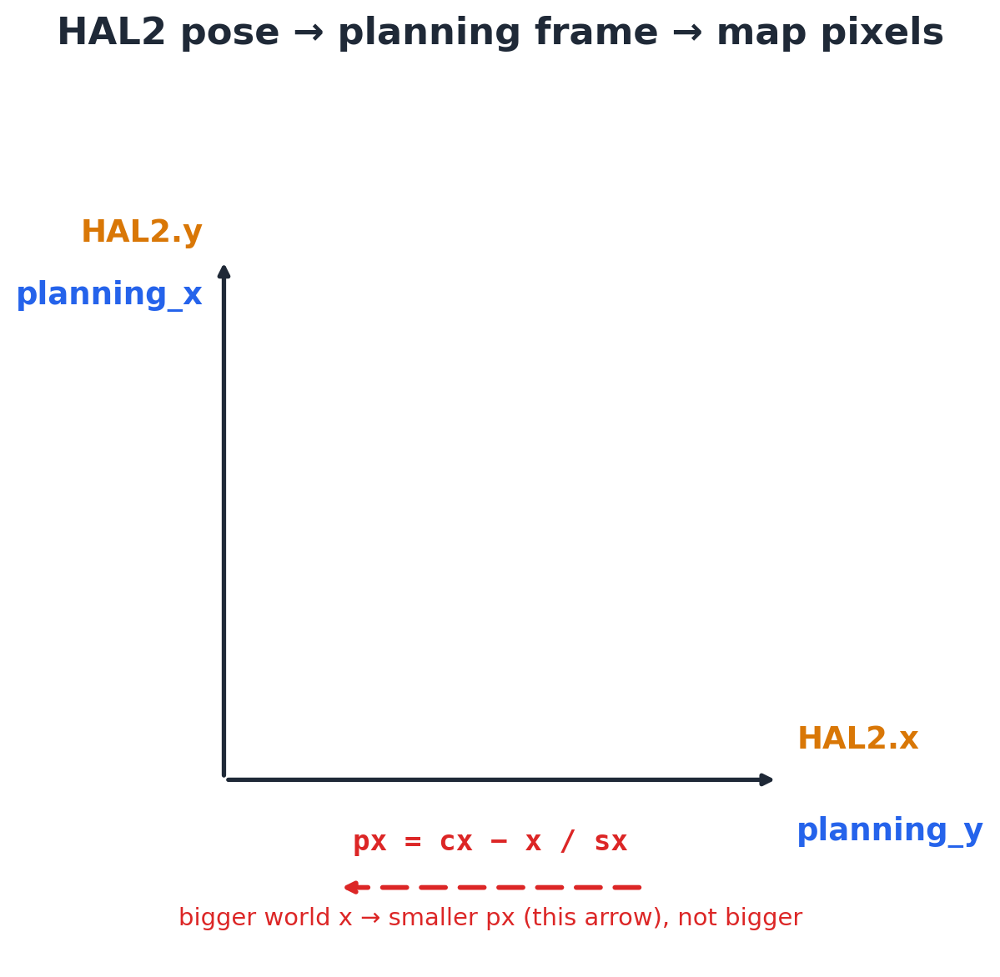
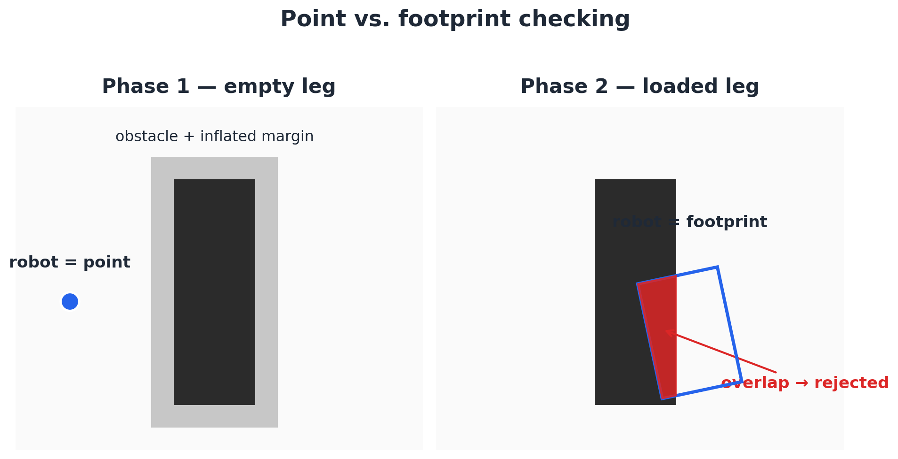

# Amazon Warehouse

<div align="center">
</a> 
</div>

<h3 align="center"> Amazon Warehouse </h3>

<div align="center">


</div>


---
 
## Table of Contents
- [Task Description](#task-description)
- [Robot API](#robot-api)
- [1. Map Loading and Occupancy Grid](#1-map-loading-and-occupancy-grid)
- [2. Coordinate Transform and Planning Frame](#2-coordinate-transform-and-planning-frame)
- [3. Two-Tier Validity Checking](#3-two-tier-validity-checking)
- [4. RRT* Path Planning](#4-rrt-path-planning)
- [5. Planner Fallback (RRTConnect)](#5-planner-fallback-rrtconnect)
- [6. Pose Repair (Radial Search)](#6-pose-repair-radial-search)
- [7. Reactive Motion Control](#7-reactive-motion-control)
- [8. Delivery Cycle Overview](#8-delivery-cycle-overview)
- [9. Loop Timing via Frequency](#9-loop-timing-via-frequency)
- [10. Platform Synchronization](#10-platform-synchronization)
- [11. Visualization and Debug in WebGUI2](#11-visualization-and-debug-in-webgui2)
- [Video Demo](#video-demo)
---
 
## Task Description
 
The objective of this exercise is to implement the logic that lets a logistics robot move shelves between fixed points in a warehouse, using its own localized position. The robot knows the map and its pose in it; the main objective is to find the shortest feasible path for each leg of the trip.
 
requirements:
 
- Use **OMPL** for path planning and a purely position-based reactive controller for execution.
- Stage 1: plan as a 2D point, with obstacles inflated by the robot's radius, using the square holonomic robot.
- Stage 2: stop inflating obstacles, but give the outbound and return legs different robot geometries — the loaded robot (shelf on board) is no longer a point.
---
 
## Robot API
 
**Pose & Motion**
 
|  |  |
|---|---|
| `HAL2.getPose3d()` | Robot pose `(x, y, yaw)` in world coordinates. |
| `HAL2.getSimTime()` | Simulation time (`.sec`, `.nanosec`). |
| `HAL2.setV(v)` | Linear speed (m/s). |
| `HAL2.setW(w)` | Angular speed (rad/s). |
 
**Platform**
 
|  |  |
|---|---|
| `HAL2.lift()` | Lift the platform (shelf on board). |
| `HAL2.putdown()` | Put the platform down. |
 
**Map & Visualization**
 
|  |  |
|---|---|
| `WebGUI2.getMap(path)` | Map image as R, G, B values in **[0, 1]**. |
| `WebGUI2.showNumpy(mat)` | Displays a `uint8` matrix — 0–127 grayscale, 128–134 preset colors. |
| `WebGUI2.showPath(array)` | Draws a path (pixel coordinates) on the map. |
 
**Loop Timing**
 
|  |  |
|---|---|
| `Frequency.tick(rate)` | Regulates the execution rate (default 50 Hz). |
 
---
 
## 1. Map Loading and Occupancy Grid
 
`WebGUI2.getMap()` returns R, G, B in **[0, 1]**, not the usual 0–255 range — that has to be normalized before thresholding on the blue channel:
 
```python
img = image_to_uint8(WebGUI2.getMap(MAP_IMAGE))   # -> uint8, 0-255
free_mask = img[:, :, 2] >= MAP_BLUE_THRESHOLD    # blue channel, R,G,B order
occ = np.full(free_mask.shape, PIXEL_OBS, np.uint8)
occ[free_mask] = PIXEL_FREE
```
 
**Design choices:**
- Reading through `getMap()` instead of `cv2.imread()`-ing the file directly, so the map always matches what `WebGUI2` itself is showing.
- Obstacles are additionally inflated (`cv2.dilate`) for the empty/point phase only — see [§3](#3-two-tier-validity-checking).
---
 
## 2. Coordinate Transform and Planning Frame
 
Planning, the occupancy grid, and the pickup/drop tables all use a frame swapped relative to `HAL2`:
 
```python
# planning_x == HAL2.y  |  planning_y == HAL2.x
start_xyyaw = (pose.y, pose.x, pose.yaw)
 
px = int(cx - x / sx)
py = int(cy - y / sy + y_offset)
```
 
The swap is what makes the hardcoded pickup/drop coordinates line up with the shelf coordinates published for the warehouse. It's kept local to the world↔pixel and world↔HAL2 boundary functions so it doesn't leak into the planning logic itself.
 
<div align="center">

</div>
---
 
## 3. Two-Tier Validity Checking
 
Point-checking against an inflated map for the empty leg; full-footprint checking against the raw map for the loaded leg — matching the exercise's two suggested strategies:
 
```python
empty_checker  = partial(state_is_free_point,     occ_map=occ_inflated, tf=tf)
loaded_checker = partial(state_is_free_footprint, occ_map=occ_return,   tf=tf, robot_lw=ROBOT_LOADED_LW)
```
 
`footprint_free()` samples a grid of points across the robot's rotated rectangle and rejects the state if any sample lands on an obstacle — the loaded shelf is treated as part of the robot's shape, not as a separate obstacle.
 
<div align="center">

</div>
---
 
## 4. RRT* Path Planning
 
#### `plan_rrt_star(start_xyyaw, goal_xyyaw, validity_checker, solve_time_s)`
 
**Parameters:**
- `start_xyyaw` / `goal_xyyaw`: `(x, y, yaw)` in the planning frame.
- `validity_checker`: `empty_checker` or `loaded_checker`.
- `solve_time_s`: time budget handed to `RRTstar` (8 s empty / 12 s loaded).
**Return:** list of `(x, y)` waypoints, or `None` if no path was found.
 
**Usage:**
```python
path_out = plan_rrt_star(start_xyyaw, pick_xyyaw, empty_checker, solve_time_s=EMPTY_PLAN_TIME_S)
```
 
Core setup:
 
```python
si.setStateValidityCheckingResolution(VALIDITY_RESOLUTION)   # fraction of the space's extent
pdef.setStartAndGoalStates(start, goal, GOAL_TOLERANCE_M)
pdef.setOptimizationObjective(ob.PathLengthOptimizationObjective(si))
planner = og.RRTstar(si)
planner.setRange(RRTSTAR_RANGE)
```
 
`VALIDITY_RESOLUTION = 0.004` is ~0.4% of the world's extent (finer than OMPL's 1% default) — checked this against the OMPL docs, since it's a fraction, not meters, and the loaded footprint (1.20 × 0.90 m) needs a fine check to not skip a thin obstacle between two valid samples. `PathLengthOptimizationObjective` makes the "shortest path" requirement explicit.
 
---
 
## 5. Planner Fallback (RRTConnect)
 
`RRTstar` uses its full time budget refining a solution rather than stopping at the first one; if it still finds nothing, a faster non-optimizing planner gets a shorter shot before the cycle gives up:
 
```python
solved = planner.solve(solve_time_s)
if not solved:
    fallback = og.RRTConnect(si)
    fallback.setProblemDefinition(pdef)
    solved = fallback.solve(max(2.0, solve_time_s * 0.4))
```
 
---
 
## 6. Pose Repair (Radial Search)
 
#### `find_near_valid_pose(x, y, yaw, checker, max_radius=0.85)`
 
**Parameters:** a candidate pose, the checker to validate against, and how far out to search.
 
**Return:** the nearest valid `(x, y, yaw)` found on an expanding ring search; the original pose if nothing validates within `max_radius`.
 
**Usage:**
```python
start_xyyaw = find_near_valid_pose(*start_xyyaw, checker=validity_checker)
```
 
Neither the robot's live pose nor the published pickup/drop coordinates are guaranteed valid for a given checker (e.g. the loaded footprint may not exactly fit the published point). This searches outward in rings of increasing radius instead of only backing up along the current heading, and it's applied to both start and goal, on both legs.
 
---
 
## 7. Reactive Motion Control
 
Simple P control on heading and distance — no path-follower beyond the robot's own localized pose:
 
```python
if abs(ang_err) > TURN_ONLY_LIMIT:
    HAL2.setV(0.0); HAL2.setW(kp_w * ang_err)
else:
    HAL2.setW(kp_w * ang_err)          # keep correcting heading while moving
    HAL2.setV(min(kp_v * dist, v_max))
```
 
**Behavior:**
- Turn in place while heading error is large.
- Once roughly aligned, drive forward while *still* correcting heading (not a hard stop-turn-go split) so the robot converges onto the line instead of overshooting it.
- Stop once within tolerance of the target.
---
 
## 8. Delivery Cycle Overview
 
| Step | Action |
|---:|---|
| 1 | Plan route to pickup spot — point checker, inflated map |
| 2 | Drive the route |
| 3 | Rotate to pickup yaw, lift the shelf |
| 4 | Plan route to drop spot — footprint checker, loaded robot, no inflation |
| 5 | Drive the route (or `putdown()` + retry if no route exists) |
| 6 | Rotate to drop yaw, put the shelf down |
| 7 | Advance to the next pickup/drop pair |
 
---
 
## 9. Loop Timing via Frequency
 
Every wait in the program — waypoint following, rotation, lift/putdown — goes through one helper instead of scattered `time.sleep()` calls:
 
```python
def tick(rate=CONTROL_HZ):
    Frequency.tick(rate)
```
 
---
 
## 10. Platform Synchronization
 
Lift/putdown are treated as taking real time rather than being instant, timed against **simulated** time rather than the wall clock (the exercise notes the Gazebo RTF factor can distort real-time waits):
 
```python
while get_sim_seconds() < end_t:
    HAL2.lift() if lifting else HAL2.putdown()
    tick()
```
 
---
 
## 11. Visualization and Debug in WebGUI2
 
Uses `WebGUI2`'s documented value scheme directly (0–127 grayscale, no arbitrary color tuples on a single-channel map):
 
```python
marked = paint_pickup_zone(occ_raw, tf, x, y, size_xy=(1.5, 3.0), value=PIXEL_FREE)
WebGUI2.showNumpy(marked)
WebGUI2.showPath(world_path_to_pixels(tf, path))
```
 

## Video Demo
[video demo at x4 speed](https://urjc-my.sharepoint.com/:v:/g/personal/g_alcocer_2020_alumnos_urjc_es/IQA1gb_HFFn1TodP_kEi5JHdAdqVdnHEcDOKAoB82mDBFuc?nav=eyJyZWZlcnJhbEluZm8iOnsicmVmZXJyYWxBcHAiOiJTdHJlYW1XZWJBcHAiLCJyZWZlcnJhbFZpZXciOiJTaGFyZURpYWxvZy1MaW5rIiwicmVmZXJyYWxBcHBQbGF0Zm9ybSI6IldlYiIsInJlZmVycmFsTW9kZSI6InZpZXcifX0%3D&e=5ugB0u)
