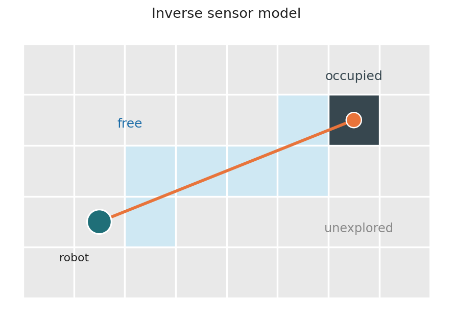
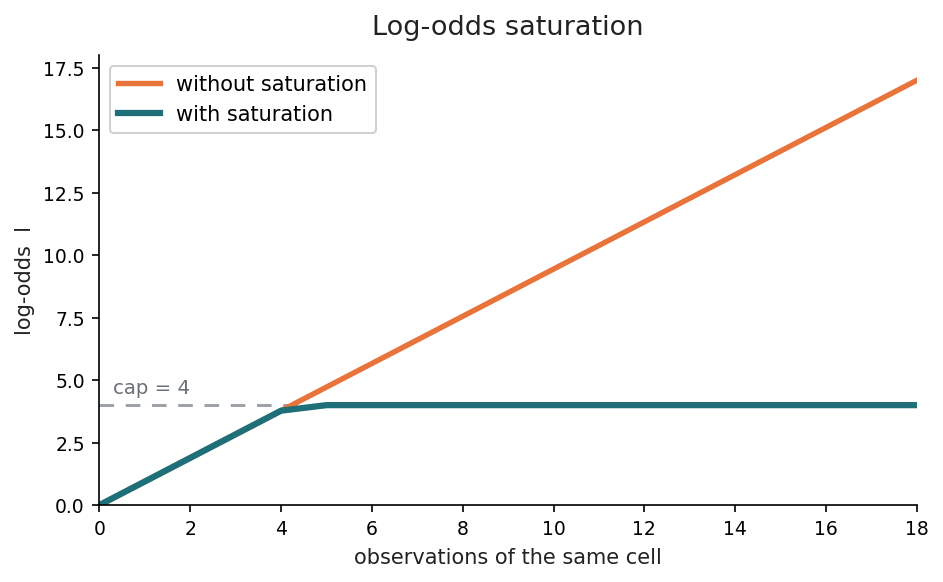
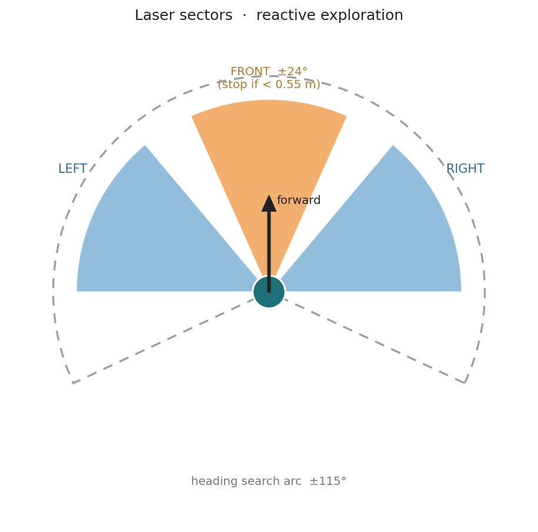

# Laser Mapping

<div align="center">
</a> 
</div>

<h3 align="center"> Laser Mapping </h3>

<div align="center">


</div>


---
 
## Table of Contents
- [Task Description](#task-description)
- [Overview](#overview)
- [Robot API](#robot-api)
- [High-Level Pipeline](#high-level-pipeline)
- [Code Architecture](#code-architecture)
- [Occupancy Grid: The Probabilistic Model](#occupancy-grid-the-probabilistic-model)
  - [1. Log-Odds Representation](#1-log-odds-representation)
  - [2. Inverse Sensor Model](#2-inverse-sensor-model)
  - [3. Recursive Bayesian Update](#3-recursive-bayesian-update)
  - [4. Saturation](#4-saturation)
  - [5. Vectorized Ray Integration](#5-vectorized-ray-integration)
- [World ↔ Map Calibration](#world--map-calibration)
- [Exploration Strategy](#exploration-strategy)
  - [1. Sector Sensing](#1-sector-sensing)
  - [2. Frontier-Like Heading Selection](#2-frontier-like-heading-selection)
  - [3. Navigation State Machine](#3-navigation-state-machine)
  - [4. Stuck Watchdog &amp; Escape](#4-stuck-watchdog--escape)
- [Measurement Independence](#measurement-independence)
- [Visualization](#visualization)
- [Parameter Reference](#parameter-reference)
- [Testing with Odometry Noise](#testing-with-odometry-noise)
- [Video Demo](#video-demo)
---
 
## Task Description
 
A **TurtleBot3** equipped with a 360° LIDAR must **autonomously explore** an
industrial warehouse and build a **2D probabilistic occupancy grid** of it,
using only its (noisy) odometry — `HAL.getOdom` — for localization.
 
The exercise splits into two coupled problems:
 
- **(a) Exploration** — an algorithm that makes the robot wander through unknown
  space and cover the whole reachable area **without collisions**.
- **(b) Mapping** — build the grid with a **probabilistic sensor model** and
  combine evidence across scans using **Bayes' rule** (in log-odds), including a
  **saturation** mechanism so probabilistic inertia never grows unbounded.
Because the laser barely opens angularly, each beam is treated as a thin line
(axial geometry is a good approximation), and the resulting map quality is
directly tied to how good the localization is — which is exactly what makes the
noisy-odometry test at the end interesting.
 
---
 
## Overview
 
Every control cycle performs three steps — **perceive → map → act** — and repeats:
 
1. **Perceive:** read odometry and the laser scan, expressed in the robot frame.
2. **Map:** if the robot moved enough, cast every beam into the log-odds grid
   (free along the ray, occupied at the endpoint) and saturate.
3. **Act:** score candidate headings (favoring open + unexplored space), run a
   small reactive state machine, and send `V` / `W`.
The map is pushed to the GUI as a grayscale image where **occupied = black,
free = white, unknown = gray**.
 
---
 
## Robot API
 
| Function | Purpose |
|---|---|
| `HAL.getOdom()` | Noisy odometry pose (`.x`, `.y`, `.yaw`). Noise depends on the world. |
| `HAL.getLaserData()` | LIDAR scan object (360 values). |
| `HAL.setV(v)` | Set linear velocity **V** (m/s). |
| `HAL.setW(w)` | Set angular velocity **W** (rad/s). |
| `WebGUI.poseToMap(x, y, yaw)` | World coordinates → map pixel `[col, row, yaw]`. |
| `WebGUI.setUserMap(image)` | Display a `970 × 1500` `uint8` grayscale map. |
| `Frequency.tick(rate)` | Regulate the control-loop rate. |
 
#### Laser Attributes
 
| Attribute | Meaning |
|---|---|
| `values` | 360 distance readings *(m)* |
| `minAngle` / `maxAngle` | Angular span of the scan *(rad)* |
| `minRange` / `maxRange` | Valid range bounds *(m)* |
 
> **Convention used here:** index `0` points **forward**, angles increase
> counter-clockwise. `inf` means "no return" (free up to the cap); readings out
> of `[minRange, maxRange]` are discarded.
 
---
 
## High-Level Pipeline
 
```text
        HAL.getOdom()                 HAL.getLaserData()
              |  pose                        |  raw scan
              |                              v
              |                        read_laser()
              |                     (ranges + angles,
              |                       robot frame)
              +---------------+--------------+
                              |
              +---------------+---------------+
              v                               v
      choose_heading()                  update_grid()
     (exploration score)          (inverse sensor model +
              |                     Bayes in log-odds +
              v                        saturation)
      _compute_command()                    |
      (state machine)                       v
              |                       setUserMap(image)
              v
       HAL.setV / HAL.setW
```
 
---
 
## Code Architecture
 
 
- **`MappingState`** — everything that must survive between iterations (the grid,
  the calibration transform, timers, the navigation mode…).
- **Typed bundles (`namedtuple`)** — `Pose`, `Scan`, `Sectors`, `MapView` keep
  function signatures short and self-documenting.
- **Small single-responsibility helpers** — `read_laser`, `update_grid`,
  `choose_heading`, `_compute_command`, `_apply_free`, `_apply_occupied`, etc.
```python
Pose = collections.namedtuple("Pose", ["x", "y", "yaw"])
Scan = collections.namedtuple("Scan", ["ranges", "angles",
                                       "min_range", "max_range"])
Sectors = collections.namedtuple("Sectors", ["front", "front_min",
                                             "left", "right"])
MapView = collections.namedtuple("MapView", ["grid", "transform"])
 
 
class MappingState:
    """Mutable state that persists across control iterations."""
 
    def __init__(self):
        self.grid = np.zeros((MAP_HEIGHT_PX, MAP_WIDTH_PX), dtype=np.float32)
        self.transform = None
        self.mode = MODE_EXPLORE
        # timers, last integrated pose, stuck-detection anchors, ...
```
 
The loop then reads/writes that state and delegates the work:
 
```python
STATE = MappingState()
 
while True:
    Frequency.tick(LOOP_RATE_HZ)
    # perceive -> map -> act, all operating on STATE
    ...
```
 
---
 
## Occupancy Grid: The Probabilistic Model
 
The map is a grid where each cell holds the **log-odds** of being occupied.
Instead of storing a probability directly, we store its log-odds `l`, because it
turns the Bayesian update into a plain **sum** and keeps the math numerically
stable.
 
### 1. Log-Odds Representation
 
```text
             p                                 1
   l = log ------- (odds)      p = -----------------------
           1 - p                        1 + e^(-l)
```
 
A cell starts at `l = 0`, i.e. `p = 0.5` (**unknown**). Positive `l` → occupied,
negative `l` → free.
 
```python
FREE_PROB = 0.35
OCC_PROB = 0.72
FREE_LOG = math.log(FREE_PROB / (1.0 - FREE_PROB))   # < 0  (evidence: free)
OCC_LOG  = math.log(OCC_PROB  / (1.0 - OCC_PROB))     # > 0  (evidence: occupied)
```
 
### 2. Inverse Sensor Model
 
<div align="center">

</div>
In the diagram, the beam leaves the **robot** (teal); every cell it passes through
is flagged **free** (light blue), the cell at its tip is **occupied** (dark), and
any cell the beam never reaches stays **unexplored** (gray). The two evidence
lengths below are exactly what draws that light-blue trail and the dark endpoint.
 
Each beam carries two pieces of evidence: the cells it **crosses** are free, and
the cell where it **ends** is occupied. A key detail is `HIT_MARGIN_M`: the last
few centimetres before the wall are **not** marked free, so we don't erase the
very wall we just detected.
 
```python
# distance marked FREE along each beam, and the endpoint distance:
free_lengths = np.where(
    hits, np.maximum(beam_ranges - HIT_MARGIN_M, 0.0), scan.max_range)
end_lengths = np.where(hits, beam_ranges, scan.max_range)
```
 
`inf` readings (no echo) are treated as *free all the way to the range cap* — they
still carry information (that space is empty), so they must not be discarded.
 
### 3. Recursive Bayesian Update
 
In log-odds, combining a new measurement `z_t` with the previous belief is just
addition (the `-l0` prior term vanishes because `l0 = 0`):
 
```text
   l_t(cell) = l_{t-1}(cell) + inverse_sensor_model(cell, z_t)
```
 
```python
np.add.at(grid, (free_rows, free_cols), FREE_LOG)   # crossed cells  (l += l_free)
np.add.at(grid, (hit_rows,  hit_cols),  OCC_LOG)    # endpoints      (l += l_occ)
```
 
> `np.add.at` is used (instead of `grid[idx] += v`) so that **multiple beams
> hitting the same cell in one scan accumulate**, which is the intended behavior:
> more hits on a cell → more confidence it is occupied.
 
### 4. Saturation
 
Without a cap, a heavily-observed cell would reach a huge `|l|` and take hundreds
of contrary measurements to change. Clipping bounds the **probabilistic inertia**:
a saturated cell can flip back within ~10 opposite observations — essential when
the odometry drifts.
 
<div align="center">

</div>
In the plot, a single cell is observed as *occupied* over and over. The **orange**
line (no cap) grows without bound, while the **teal** line flattens at the dashed
**cap = 4**. Keeping `|l| ≤ 4` is what stops a heavily-seen cell from becoming so
certain that later contrary measurements can no longer change it — and the single
`np.clip` below is precisely what turns the orange line into the teal one.
 
```python
LOG_ODDS_MIN = -4.0
LOG_ODDS_MAX = 4.0
np.clip(grid, LOG_ODDS_MIN, LOG_ODDS_MAX, out=grid)   # applied after every scan
```
 
### 5. Vectorized Ray Integration
 
Rather than looping over beams and cells in Python, each beam is **sampled** at a
fixed step and the whole scan is projected to pixels in a couple of NumPy ops.
Occupied endpoints are additionally **dilated by 1 px** so thin walls render
clearly.
 
```python
steps = np.arange(RAY_STEP_M, scan.max_range, RAY_STEP_M, dtype=np.float32)
step_grid = steps[None, :]
free_mask = step_grid < free_lengths[:, None]   # only cells before the hit
 
# occupied endpoint + 1-px dilation (weaker evidence on the neighbors):
side = OCC_NEIGHBOR_FACTOR * OCC_LOG
np.add.at(grid, (rows + margin, cols), side)
np.add.at(grid, (rows - margin, cols), side)
np.add.at(grid, (rows, cols + margin), side)
np.add.at(grid, (rows, cols - margin), side)
```
 
---
 
## World ↔ Map Calibration
 
`poseToMap` is too slow to call per cell, so it is queried exactly **three times**
— at the origin and at `+1 m` along X and Y — to fit an **affine** transform.
Thousands of beam cells are then projected with a single vectorized expression.
 
```python
origin = WebGUI.poseToMap(x_pos, y_pos, 0.0)
x_ref  = WebGUI.poseToMap(x_pos + CALIB_OFFSET_M, y_pos, 0.0)   # +1 m in X
y_ref  = WebGUI.poseToMap(x_pos, y_pos + CALIB_OFFSET_M, 0.0)   # +1 m in Y
```
 
The affine automatically absorbs pixels-per-meter **scale** and the **Y-axis
flip** between world and image, so no manual sign juggling is needed:
 
```python
col = col_0 + (x_world - x_ref) * dx_col + (y_world - y_ref) * dy_col
row = row_0 + (x_world - x_ref) * dx_row + (y_world - y_ref) * dy_row
```
 
---
 
## Exploration Strategy
 
<div align="center">

</div>
The diagram shows the only slices of the scan the controller actually reads: a
narrow **front** cone (orange, ±24°, used for the stop test), wider **left** and
**right** sectors (blue) for centering, and the dashed **±115° arc** across which
candidate headings are scored. The two functions below extract those sectors.
 
### 1. Sector Sensing
 
The laser is reduced to a few **angular sectors** (front, left, right). For
navigation distances a **low percentile** is used instead of the raw minimum, so
a single spurious beam can't trigger a false stop:
 
```python
def sector_distance(scan, center, half_width):
    values = sector_ranges(scan, center, half_width)
    if values.size == 0:
        return scan.max_range
    return float(np.percentile(values, SECTOR_PERCENTILE))   # robust near-min
```
 
The emergency check *does* use the true minimum (`sector_min`), because for
collision avoidance we want the closest obstacle, no smoothing.
 
### 2. Frontier-Like Heading Selection
 
Several candidate headings across a `±115°` arc are scored, and the best wins.
The score rewards **open space** and **unexplored regions** (the "frontier"),
prefers going straight, and penalizes blocked directions:
 
```python
score = (WEIGHT_FREE * free_score          # is there room ahead?
         + WEIGHT_UNKNOWN * unknown_score   # is there still unexplored space?
         + straight_bonus                   # prefer going straight
         - blocked_penalty                  # avoid blocked sectors
         + noise)                           # tiny tie-breaker
```
 
`unknown_score` samples the grid along the candidate direction and measures the
fraction of cells still near `l = 0` (unexplored), which is what pulls the robot
toward the frontier of the known map.
 
### 3. Navigation State Machine
 
| State | Behavior |
|---|---|
| `explore` | Follow the chosen heading; steer + cruise while the path is clear. |
| `escape`  | Spin in place (alternating sign) to break out of a stall. |
 
Inside `explore`, the command is chosen from the front sectors:
 
| Condition | Action |
|---|---|
| `front_min < EMERGENCY_STOP_M` | Stop and turn toward the **more open** side. |
| `front < FRONT_STOP_M` | Stop and turn toward the **chosen heading**. |
| otherwise | **Cruise**: proportional speed + lateral centering. |
 
```python
if state.mode == MODE_ESCAPE:
    if now < state.escape_until:
        return 0.0, state.escape_sign * MAX_W   # spin in place
    state.mode = MODE_EXPLORE
 
if sectors.front_min < EMERGENCY_STOP_M:        # obstacle dead ahead
    _turn_toward_open(state, now, sectors)
    angular_vel = state.turn_sign * MAX_W
elif sectors.front < FRONT_STOP_M:              # blocked -> turn to heading
    _turn_toward_heading(state, now, sectors, target_heading)
    angular_vel = state.turn_sign * MAX_W
else:                                           # clear -> cruise
    linear_vel, angular_vel = _cruise_command(sectors, target_heading)
```
 
Cruising slows down as obstacles get closer and gently centers the robot between
left/right walls (useful in tight aisles):
 
```python
speed_scale = clip((sectors.front - FRONT_STOP_M) / span, 0.0, 1.0)
linear_vel = SLOW_V + (MAX_V - SLOW_V) * speed_scale
centering = CENTERING_GAIN * clip(sectors.left - sectors.right, -2.0, 2.0)
angular_vel = clip(TARGET_YAW_GAIN * target_heading + centering, -MAX_W, MAX_W)
```
 
### 4. Stuck Watchdog & Escape
 
A watchdog compares the current position against an anchor every
`STUCK_PERIOD_S`. If the robot barely moved, it switches to `escape` and spins in
place, flipping the spin direction each time so it doesn't retry the same corner:
 
```python
if moved < STUCK_DIST_M and state.mode != MODE_ESCAPE:
    state.mode = MODE_ESCAPE
    state.escape_sign *= TURN_RIGHT              # alternate the spin sign
    state.escape_until = now + ESCAPE_TIME_S
```
 
---
 
## Measurement Independence
 
A scan is integrated only after the robot has **moved or turned enough** and a
minimum period has elapsed. Scans taken too close together are nearly identical
and would cause **overconfidence** (and wasted computation):
 
```python
return elapsed >= MAP_MIN_PERIOD_S and (moved  >= MAP_DIST_STEP_M
                                        or turned >= MAP_ANGLE_STEP_RAD)
```
 
---
 
## Visualization
 
Log-odds are converted to grayscale through the logistic function (clipped to
avoid overflow), so the image is directly interpretable:
 
```python
clipped = np.clip(grid, -SIGMOID_CLIP, SIGMOID_CLIP)
occ_prob = 1.0 / (1.0 + np.exp(-clipped))
image = (GRAY_MAX * (1.0 - occ_prob)).astype(np.uint8)   # occ→black, free→white
WebGUI.setUserMap(image)                                 # unknown (0.5) → gray
```
 
Rendering is throttled (`DISPLAY_PERIOD_S`) because pushing a 1.4 MP image every
tick is expensive and unnecessary.
 
---
 
## Parameter Reference
 
All tunables live at the top of the file as named constants (no magic numbers).
The most relevant ones:
 
| Constant | Value | Role |
|---|---|---|
| `MAX_RANGE_M` | `7.0` | Range cap; farther readings are unreliable. |
| `FREE_PROB` / `OCC_PROB` | `0.35` / `0.72` | Inverse-sensor-model probabilities. |
| `LOG_ODDS_MIN` / `LOG_ODDS_MAX` | `-4.0` / `4.0` | Saturation bounds. |
| `HIT_MARGIN_M` | `0.08` | Free-space margin kept before a wall. |
| `BEAM_STEP` | `2` | Sub-sampling of beams. |
| `RAY_STEP_M` | `0.06` | Sampling step along a beam. |
| `MAP_DIST_STEP_M` / `MAP_ANGLE_STEP_RAD` | `0.07` / `0.06` | Update gating. |
| `MAX_V` / `SLOW_V` / `MAX_W` | `0.18` / `0.08` / `0.85` | Speed limits. |
| `FRONT_STOP_M` / `EMERGENCY_STOP_M` | `0.55` / `0.32` | Safety thresholds. |
| `SEARCH_ARC_RAD` | `115°` | Heading-search arc. |
| `WEIGHT_FREE` / `WEIGHT_UNKNOWN` | `0.80` / `1.15` | Exploration score weights. |
 
Two extra knobs exist only for laser-convention fixes:
 
| Constant | When to change |
|---|---|
| `REVERSE_LASER` | Flip to `True` if the map comes out mirrored. |
| `LASER_YAW_OFFSET_RAD` | Add an offset if the whole map is rotated by a constant. |
 
---
 
## Testing with Odometry Noise
 
The point of the exercise: **same code, worse localization → worse map.** You do
**not** change the code — you change the world in the bottom toolbar and watch the
walls smear as drift accumulates:
 
```text
Small Laser Mapping Warehouse   ->   ... Medium Noise   ->   ... High Noise
```
 
> The statement mentions `getOdom2` / `getOdom3` (noisier sources). That API is
> not actually exposed — the noise level is defined by the chosen world — so
> `current_odom()` keeps them as a hook and falls back to `getOdom()`.
 
 
---

## Video Demo
[video demo at x4 speed](https://urjc-my.sharepoint.com/:v:/g/personal/g_alcocer_2020_alumnos_urjc_es/IQBrFRNibxLKQ7gJDO5hu8WJASW1vF_JxHLyCIAuKlPqMuk?nav=eyJyZWZlcnJhbEluZm8iOnsicmVmZXJyYWxBcHAiOiJTdHJlYW1XZWJBcHAiLCJyZWZlcnJhbFZpZXciOiJTaGFyZURpYWxvZy1MaW5rIiwicmVmZXJyYWxBcHBQbGF0Zm9ybSI6IldlYiIsInJlZmVycmFsTW9kZSI6InZpZXcifX0%3D&e=HPhpWG)
