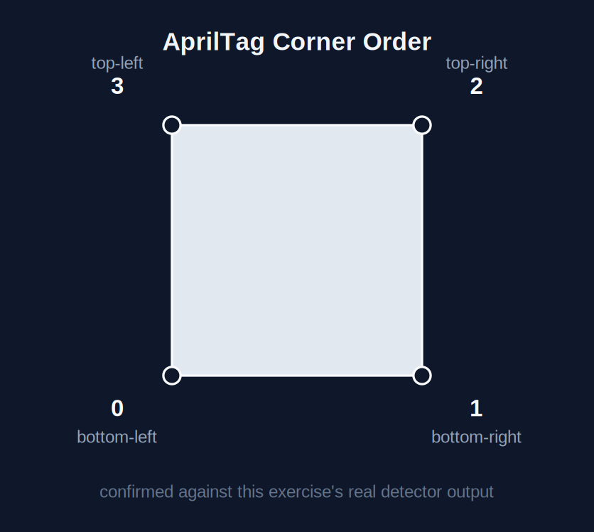
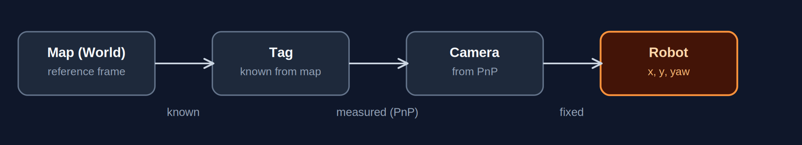
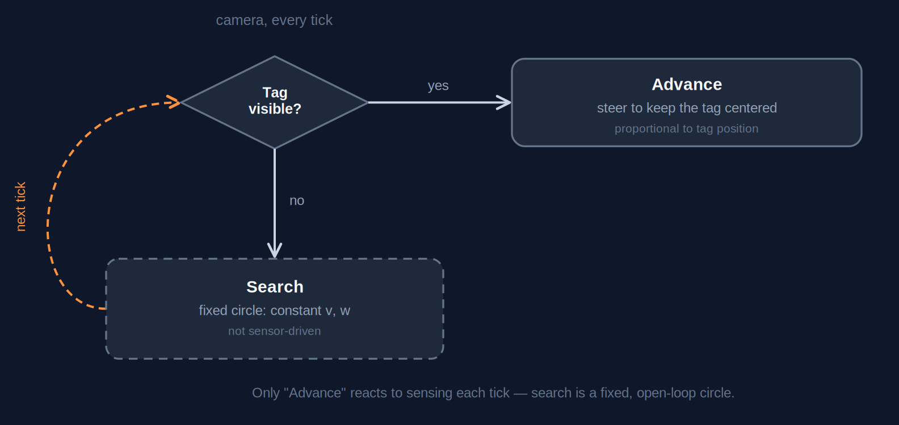

# Marker Based Visual Loc

<div align="center">
</a>
</div>

<h3 align="center"> Marker Based Visual Loc </h3>

<div align="center">


</div>

## Table of Contents
- [Task Description](#task-description)
- [Robot API Used in the Practice](#robot-api-used-in-the-practice)
- [1. Map Loading and Tag Poses](#1-map-loading-and-tag-poses)
- [2. Homogeneous Transforms (RT Matrices)](#2-homogeneous-transforms-rt-matrices)
- [3. AprilTag Detection and Corner Ordering](#3-apriltag-detection-and-corner-ordering)
- [4. PnP: Camera-to-Tag Relative Pose](#4-pnp-camera-to-tag-relative-pose)
- [5. Fusing PnP with Odometry Increments](#5-fusing-pnp-with-odometry-increments)
- [6. Filtering Out Ambiguous PnP Solutions](#6-filtering-out-ambiguous-pnp-solutions)
- [7. Exploration](#7-exploration)
- [8. Visualization and Debug in WebGUI](#8-visualization-and-debug-in-webgui)
- [Video Demo](#video-demo)

---

## Task Description

The objective of this exercise is to implement a reliable self-localization
algorithm for a robot equipped with a camera and odometry, moving around a
domestic environment instrumented with AprilTag visual markers. The robot must
detect the markers, estimate its pose relative to each one using
Perspective-n-Point (PnP), and combine that relative pose with the marker's
known absolute pose (stored in a map) to obtain its own absolute position and
orientation. When no marker is visible, the position is propagated using only
the *increment* measured by odometry since the last marker sighting. The
odometry's absolute reading is never used as a position by itself.

---

## Robot API Used in the Practice

- `HAL.getImage()` - Returns the latest camera frame.
- `HAL.getOdom()` - Returns the noisy odometry pose `(x, y, yaw)`.
- `HAL.getLaserData()` - Returns 180 laser range readings, one per degree.
- `HAL.setV(v)` / `HAL.setW(w)` - Set linear / angular velocity.
- `WebGUI.showImage(image)` - Displays the debug camera view.
- `WebGUI.showEstimatedPose(pose)` - Publishes the estimated `(x, y, yaw)` to the map view.
- `pyapriltags.Detector(searchpath=["apriltags"], families="tag36h11")` - Detects AprilTags in a grayscale image.

---

## 1. Map Loading and Tag Poses

Each tag's absolute pose is read from the exercise's YAML map and converted
into a 4x4 world-frame transform once, at startup, so the main loop only ever
does a dictionary lookup by tag ID:

```python
def load_map():
    """Read the YAML map and return world_T_tag transforms by id."""
    try:
        conf = yaml.safe_load(Path(MAP_PATH).read_text())
    except Exception:
        return {}
    entries = conf.get("tags", {}) if conf is not None else {}
    tag_map = {}
    for name, data in entries.items():
        try:
            tag_id = int(name.split("_")[-1])
            raw_pose = data["position"]
            map_x = float(raw_pose[X])
            map_y = float(raw_pose[Y])
            map_z = float(raw_pose[Z])
            map_yaw = float(raw_pose[YAW])
        except Exception:
            continue
        # The exercise YAML uses an offset origin for the displayed map frame.
        world_x = map_x - MAP_OX
        world_y = map_y - MAP_OY
        tag_map[tag_id] = tag_tf(world_x, world_y, map_z, map_yaw)
    return tag_map
```

**Design choices:**
- `MAP_OX`, `MAP_OY` correct for the map file using a different local origin
  than the one odometry zeroes itself at on spawn.
- A tag ID not present in the map is never selected as a localization
  candidate later (section 4), the dictionary lookup filters it out on its own.
- The try/except blocks skip a malformed entry instead of crashing the whole
  script over one bad line in the map file.

---

## 2. Homogeneous Transforms (RT Matrices)

Every pose composition in the file, from the PnP chain down to the odometry
increment, goes through the same three helpers instead of mixing matrices in
some places and raw trigonometry in others:

```python
def pose_mat(x_pos, y_pos, yaw):
    """Build a 2-D homogeneous transform."""
    cos_yaw = math.cos(yaw)
    sin_yaw = math.sin(yaw)
    return np.array(
        [
            [cos_yaw, -sin_yaw, x_pos],
            [sin_yaw, cos_yaw, y_pos],
            [0.0, 0.0, 1.0],
        ],
        dtype=np.float64,
    )


def mat_pose(tf):
    """Extract (x, y, yaw) from a homogeneous transform (3x3 or 4x4)."""
    trans_col = tf.shape[0] - 1  # 2 for a 3x3 2-D transform, 3 for a 4x4 3-D one
    x_pos = float(tf[X, trans_col])
    y_pos = float(tf[Y, trans_col])
    yaw = math.atan2(float(tf[Y, X]), float(tf[X, X]))
    return (x_pos, y_pos, wrap_pi(yaw))


def inv_tf(tf):
    """Invert a rigid homogeneous transform."""
    dim = tf.shape[0] - 1
    rot = tf[:dim, :dim]
    trans = tf[:dim, dim]
    out = np.eye(dim + 1, dtype=np.float64)
    out[:dim, :dim] = rot.T
    out[:dim, dim] = -rot.T @ trans
    return out
```

`trans_col` is computed from the matrix shape instead of hardcoded, since
`mat_pose` gets called on both the 3x3 odometry poses and the 4x4 PnP chain.

mat_pose originally read the translation from a fixed column 2, which is
correct for the 3x3 pose matrices but not for the 4x4 ones the PnP chain
produces. Position kept coming out basically zero while yaw looked fine, so it
wasn't an obvious bug to spot at first glance.

---

## 3. AprilTag Detection and Corner Ordering

`detector.detect(gray)` returns each tag's 4 corners in a fixed but
library-specific order. A square marker has 8 geometrically valid ways to
number its corners, and several of them fit the image with essentially zero
reprojection error while describing a completely different 3D pose. The order
can't be assumed, it has to be checked against the real detector output. The
layout used here is the one below:

<div align="center">

</div>

The object points fed to `solvePnP` follow that same layout, row for row:

```python
def tag_model():
    """Return 3-D tag corners in the observed detector order."""
    # 0 bottom-left, 1 bottom-right, 2 top-right, 3 top-left.
    half = TAG_SIZE / HALF
    return np.array(
        [
            [-half, -half, 0.0],
            [half, -half, 0.0],
            [half, half, 0.0],
            [-half, half, 0.0],
        ],
        dtype=np.float64,
    )
```

**Design choices:** `TAG_SIZE = 0.24` uses only the black border, since that's
what the detector's corners actually bound (the 0.3 m figure in the task
description includes the white margin, which is never part of the detected
quadrilateral). The debug view draws the corner index next to each detection
(section 8) so this order can be checked against the live detector instead of
taken on faith.

I first used the corner order I had checked with pyapriltags on my own
machine, and the pose came out mirrored here specifically. This detector
numbers the corners differently, and the debug overlay was the only way to
actually pin down which order it uses.

---

## 4. PnP: Camera-to-Tag Relative Pose

`cv2.solvePnP` recovers the rigid transform from the tag's local frame to the
camera's optical frame. That relative RT is then chained with the tag's known
absolute pose and a fixed camera-to-robot extrinsic to get the robot's
absolute pose:

```python
    cam_t_tag_tf = pnp_tf(rvec, tvec)
    world_t_tag = tag_map[det.tag_id]
    world_t_cam = world_t_tag @ inv_tf(cam_t_tag_tf)
    world_t_robot = world_t_cam @ cam_t_robot
    return mat_pose(world_t_robot)
```

The camera-to-robot extrinsic isn't the identity: a camera's own optical
convention (X right, Y down, Z forward) is a different axis convention from
the robot's body frame (X forward, Y left, Z up). Its values come from the
`camera_joint` in the TurtleBot3 Waffle's URDF:

```python
def cam_mount_tf():
    """Return robot_T_camera for the TurtleBot3 Waffle camera."""
    # OpenCV camera axes: x right, y down, z forward.
    rot = np.array(
        [
            [0.0, 0.0, 1.0],
            [-1.0, 0.0, 0.0],
            [0.0, -1.0, 0.0],
        ],
        dtype=np.float64,
    )
    tf = np.eye(MAT4, dtype=np.float64)
    tf[:DIM3, :DIM3] = rot
    tf[:DIM3, DIM3] = [CAM_X, CAM_Y, CAM_Z]
    return tf
```

Three links, three different sources. Put together, the chain looks like
this:

<div align="center">

</div>

Only the middle link (Tag to Camera) is measured every tick, via `solvePnP`.
The other two are constants computed once, at the start of the script.

I originally left `cam_mount_tf` as an identity matrix, figuring the camera
was roughly aligned with the robot body. The heading was off by close to 90
degrees, consistently, until I pulled the real rotation from the URDF instead
of assuming it away.

Before being used, the fit is checked against two thresholds, reprojection
error (`MAX_RMSE`) and the viewing angle relative to the tag's face
(`MIN_FACE`), which rejects occlusions, blur, and near-edge-on views.

**Design choices:** among several detected tags, only the one with the
largest image area is used (closest = largest, as specified in the task).
`best_tag()` picks it via a simple shoelace-formula area comparison.

---

## 5. Fusing PnP with Odometry Increments

When a tag is visible, its PnP-derived pose is published directly. When it
isn't, the last confirmed pose is propagated forward using only the odometry
*delta* since that fix:

```python
def odom_delta(base_odom, odom_now):
    """Return the odometry increment as a 3x3 transform, in the base odom frame."""
    return inv_tf(pose_mat(*base_odom)) @ pose_mat(*odom_now)


def odom_pose(base_pose, base_odom, odom_now):
    """Propagate a visual pose with an odometry increment."""
    delta = odom_delta(base_odom, odom_now)
    return mat_pose(pose_mat(*base_pose) @ delta)
```

```python
    if meas is not None:
        tag_pose = meas
        tag_odom = odom_now
        out_pose = meas
        first_pose = None
        first_odom = None
    elif tag_pose is not None:
        out_pose = odom_pose(tag_pose, tag_odom, odom_now)
```

**Behavior:** until the very first tag is confirmed, `out_pose` stays `None`
and nothing is published. There is no legitimate absolute position to report
yet.

---

## 6. Filtering Out Ambiguous PnP Solutions

A flat marker viewed close to head-on has a known PnP ambiguity: two distinct
poses, one correct, one flipped roughly 180 degrees, can both explain the same
noisy corners almost equally well, and reprojection error alone doesn't
reliably tell them apart. A new reading is instead checked against where the
robot's own recent motion says it should be:

```python
def reject_bad_jump(meas, odom_now):
    """Reject a visual fix that disagrees too much with odometry."""
    if meas is None or tag_pose is None:
        return meas
    pred = odom_pose(tag_pose, tag_odom, odom_now)
    pos_gap, yaw_gap = pose_gap(pred, meas)
    if pos_gap > MAX_POS_JUMP or yaw_gap > MAX_YAW_JUMP:
        return None
    return meas
```

The very first sighting has nothing to compare against yet, so it separately
waits for a second, independent reading to agree with it before ever being
trusted (`check_first_pose`). A flipped solution essentially never agrees with
a second, separately-noisy reading of the same motion.

The estimate would occasionally jump several meters and flip close to 180
degrees, even on frames where the reprojection error looked fine, so that
check alone wasn't catching it. Comparing the new reading against where the
odometry says the robot should be did.

**Design choices:** both thresholds (`MAX_POS_JUMP`, `MAX_YAW_JUMP`) are
compared against odometry *deltas* only, never against an absolute odometry
reading, keeping the increments-only rule intact inside this layer too.

---

## 7. Exploration


```python
def drive_robot(laser, image, tag):
    """Send a simple exploration command."""
    try:
        front = scan_min(laser, SCAN_FRONT, SCAN_FRONT_W)
        if front < FRONT_STOP:
            left = scan_min(laser, SCAN_FRONT + SCAN_SIDE_W, SCAN_SIDE_W)
            right = scan_min(laser, SCAN_FRONT - SCAN_SIDE_W, SCAN_SIDE_W)
            turn = TURN_LEFT if left > right else TURN_RIGHT
            HAL.setV(V_BACK)
            HAL.setW(turn * W_SAFE)
            return
        if tag is not None:
            img_w = image.shape[1]
            img_cx = img_w / HALF
            tag_err = (tag.center[X] - img_cx) / img_cx
            HAL.setV(V_FWD)
            HAL.setW(-tag_err * TAG_KP)
            return
        HAL.setV(V_SEARCH)
        HAL.setW(W_SEARCH)
    except Exception:
        HAL.setV(V_STOP)
        HAL.setW(W_SEARCH)
```

Tag tracking is a proportional controller, also reactive,
continuously correcting based on where the tag sits in the frame.
`V_SEARCH`/`W_SEARCH` are fixed constants: with no obstacle and no tag, the
robot traces a constant-radius circle (about 0.53 m, from `v / w`) no matter
what the room looks like, and only changes direction when the remaining decision looks like this:

<div align="center">

</div>

The dashed border on "Search" marks the one branch that doesn't react to
anything sensed that tick. The robot's long-run path around the house ends up
looking closer to a pseudo-random walk, fixed circles interrupted by
occasional bumps, than a planned coverage sweep.

**Behavior:**
- If a tag is in view, drive toward it while steering to keep it
  centered.
- Otherwise, hold a fixed forward speed and turn rate until either of the
  above triggers.

---

## 8. Visualization and Debug in WebGUI

Every detected tag is outlined, with its corner indices and ID labelled. The
tag actually used for localization is drawn in a different color from the
rest:

```python
def draw_tag(image, det, selected):
    """Draw tag borders, center, and corner order."""
    color = CLR_TAG if selected else CLR_OTHER
    pts = det.corners.astype(int)
    for idx in range(len(pts)):
        cv2.line(
            image,
            tuple(pts[idx]),
            tuple(pts[(idx + 1) % len(pts)]),
            color,
            LINE_W,
        )
    if DRAW_CORNERS:
        for idx, pt in enumerate(pts):
            cv2.putText(
                image,
                str(idx),
                tuple(pt),
                FONT,
                CORNER_TXT,
                CLR_CORNER,
                TXT_W,
            )
```

```python
    for det in detections:
        selected = tag is not None and det.tag_id == tag.tag_id
        draw_tag(image, det, selected)
    WebGUI.showImage(image)
```

---

## Video Demo

[video demo at x4 speed](https://urjc-my.sharepoint.com/:v:/g/personal/g_alcocer_2020_alumnos_urjc_es/IQBgU2nj5PPcTa06BLeqQCIbAc2oXW0iaebVtSnocMICTs4?nav=eyJyZWZlcnJhbEluZm8iOnsicmVmZXJyYWxBcHAiOiJTdHJlYW1XZWJBcHAiLCJyZWZlcnJhbFZpZXciOiJTaGFyZURpYWxvZy1MaW5rIiwicmVmZXJyYWxBcHBQbGF0Zm9ybSI6IldlYiIsInJlZmVycmFsTW9kZSI6InZpZXcifX0%3D&e=GxNXKt)
